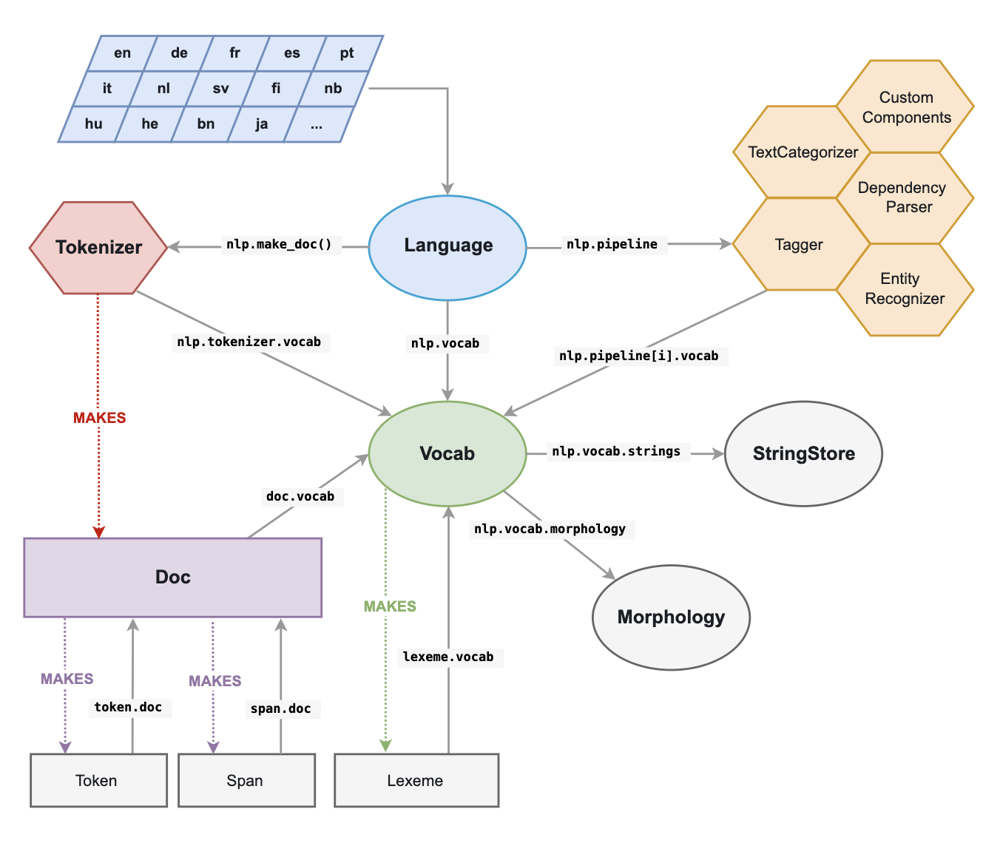

# Capstone: Musical Recommender

Kelly Slatery | US-DSI-10 | 03.13.2020

## Problem Statement

Musical fans come in all shapes and sizes and levels of intensity, but the one thing we all have in common is: we love musicals. But no matter how much of a Broadway buff you are, none of us knows ALL the popular musicals’ soundtracks word-for-word. And sometimes you just can’t match Rent’s “One Song Glory” energy. Sometimes, all we want is for someone (or something) to tell us what musical to listen to in the moment. That’s where ShowMeTunes (???) comes in: you input a short description of your current state (mood, what’s going on in your head and in your life), and ShowMeTunes will show you the show tunes you should give a listen to right when you need it. Now, you’ll never have to go another minute wondering, “ What musicals am I missing out on?” or simply, “What should I play next?”

## Data Collection

The data for the alpha version of this project was pulled from 3 sources:

- [Ranker](ranker.com): musical names for 196 most popular musicals as voted on by the public
- [Wikipedia](wikipedia.com): musical synopses
- [All Musicals](allmusicals.com): musical synopses

First, I scraped [Ranker’s list of best musicals](https://www.ranker.com/crowdranked-list/best-musicals) to get the musical names to make up the corpus of possible recommendations for users. According to [Ranker](https://www.ranker.com/list/how-our-rankings-work/rmach), their rankings are based on a “wisdom of the crowd philosophy”. Anyone can upvote or downvote items on a list, but Ranker also allows people to make an account and become a member, and the Ranker Algorithm rates members’ rerankings of lists more highly. Because I want my recommender to recommend musicals that users will likely enjoy, I wanted to exclude musicals that weren’t very well received by musical fans. Ranker allowed me to use their list for this project, however, if I were to develop it further, I would create my own ranking algorithm based on data from Spotify and Wikipedia, detailed below in [Future Developments](#Future-Developments).

After pulling the list of musical names, I had to gather the data to analyze them. For the alpha version of this project, I chose to use only textual synopses as a basis for comparison with user input. In future versions, as described in [Future Developments](#Future-Developments), I hope to add song lyrics as well. When choosing what sources to use for these synopses, I was surprised to find that there wasn’t nearly as cohesive information about musicals online as there is for movies. This is perhaps given the relative popularity of either form of entertainment, along with the already technical/digital nature of movies versus musicals. In the end, I found [Wikipedia](wikipedia.com) and [All Musicals](allmusicals.com) to provide the best synopses.

Of the 196 musicals scraped from [Ranker](ranker.com), only 2 did not have a synopsis on either [Wikipedia](wikipedia.com) or [All Musicals](allmusicals.com) (“Cyrano” and “Dancin’”). Of the remaining 194, 8 have only an [All Musicals](allmusicals.com) summary and 17 have only a [Wikipedia](wikipedia.com), leaving 169 musicals with two synopses to use for analysis. Synopsis lengths range from 37 words to 2715 words, with a median [Wikipedia](wikipedia.com) summary length of 1132 words and a median [All Musicals](allmusicals.com) summary length around half that, at 509 words.

## Data Processing

The data to be processed is all text, so a variety of NLP techniques were used to clean and preprocess the data for a variety of experimental analyses. NLP libraries used or considered for use include:
- [spaCy](https://spacy.io/): most of the processing (extracting important words, word vectorization/embedding)
- [TextBlob](https://textblob.readthedocs.io/en/dev/): sentiment analysis
- [Gensim](https://radimrehurek.com/gensim/index.html): word vectorization
- [Regex](https://docs.python.org/3/library/re.html): removing punctuation
- [nltk](https://www.nltk.org/): removing stopwords, tokenizing
- [Sci-kit learn](https://scikit-learn.org/): CountVectorizer, TfidfVectorizer, clustering models

The large majority of data processing and preprocessing was done with [spaCy](https://spacy.io/). According to the documentation, [spaCy](https://spacy.io/usage/spacy-101) is a “free, open-source library for advanced Natural Language Processing (NLP) in Python.” What this means is, when you import spaCy, you have access to various functionalities built on complex models and cutting edge research that help us process text data to build implement our own programs built on text data. Below is a general overview of spaCy’s architecture, taken from the [spaCy documentation](https://spacy.io/api):

Some of the main functionalities offered by spaCy are: Tokenization, Part-of-speech (POS) Tagging, Named Entity Recognition (NER), and [more](https://spacy.io/usage/spacy-101). SpaCy also provides pre-trained statistical models for users to use to preprocess their own text data. For the purposes of this project, I used the...

# TO BE CONTINUED TODAY!

